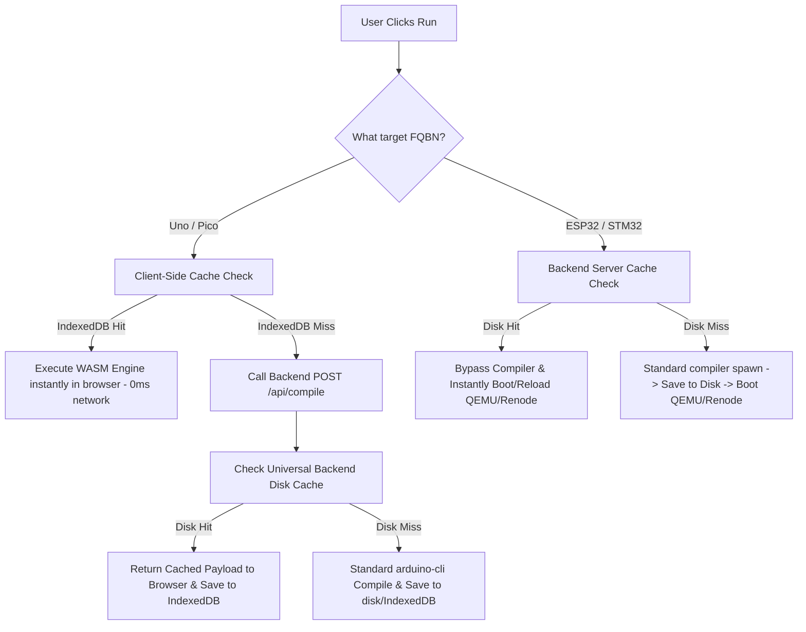
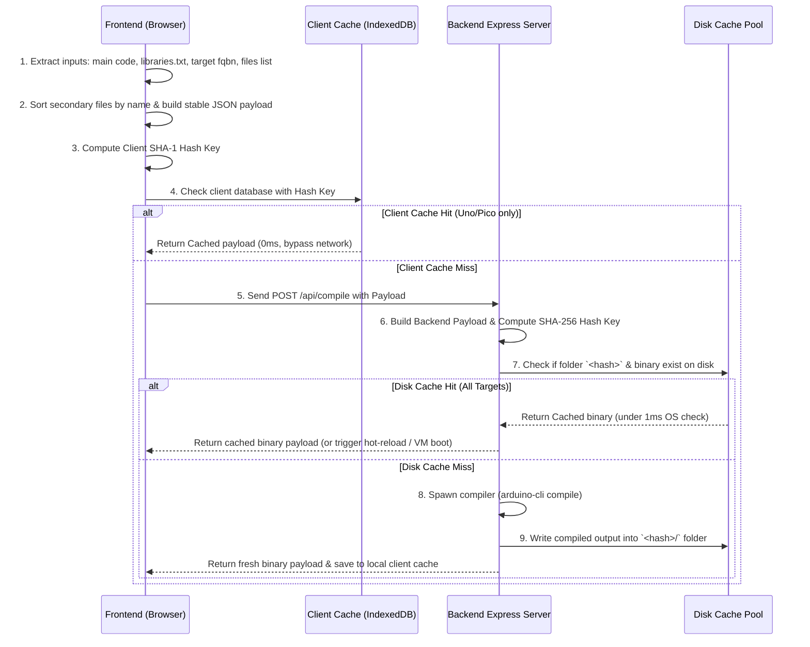

# Compilation Caching Architecture

This document describes the design, caching mechanisms, and automatic storage lifecycle management implemented across the OpenHW Studio compilation pipeline to achieve near-instant (sub-second) simulation starts.

---

## 1. High-Level Architecture Overview

To eliminate the latency of compiled simulations, OpenHW Studio uses a dual-layer compilation caching architecture scoped specifically by target runtime execution characteristics:

---

## 2. Client-Side Caching (IndexedDB)
For microcontroller targets whose simulation engines run **entirely inside the browser's WebAssembly context** (Arduino Uno and Raspberry Pi Pico), network compilation queries are completely bypassed on cache hits.

### Core Specifications:
* **Storage Engine:** Browser-native `IndexedDB` database (`OpenHW_Compile_Cache`).
* **Cache Key (SHA-1 Hash):** Generated using the standard browser Web Crypto API (`window.crypto.subtle.digest`):
  `SHA-1(code + libraries_txt + targetFqbn + builder + files)`
  * *Note: Dynamic sketch names and timestamps are excluded from the hash to prevent false cache misses on project rename/save.*
* **Eviction Policy (LRU):** Local IndexedDB storage is strictly capped at a maximum of **10 compiled sketches**. During database writes, an automatic garbage collector reads timestamp entries and evicts the oldest items to maintain a tiny storage footprint (< 2 MB).
* **Performance Impact:**
  * **Network Requests:** 0.
  * **Latency:** < 5 ms.
  * **Offline Capability:** Supported (allows running previously compiled sketches without internet access).

---

## 3. Universal Backend Cache Pools
For hardware targets whose simulation engines run as backend virtual machine processes (ESP32 Xtensa QEMU and STM32 ARM Renode), compilation is bypassed by matching pre-compiled binaries sitting directly on the server's disk storage.

### Core Specifications:
* **ESP32 Storage:** Compiled `merged-flash.bin` images cached in `builds/esp32-compile-cache/<hash>/`.
* **STM32 Storage:** Compiled `firmware.elf` binaries cached in `builds/stm32-compile-cache/<hash>/`.
* **Pico/Uno Server Fallback:** Compiled JSON payloads cached in `temp/pico-uno-compile-cache/<hash>/result.json` to support first-time runs and shared links.
* **Cache Key (SHA-256 Hash):**
  `SHA-256(code + builder + libraries_txt + board_options + spiffs_files)`
* **Latency Benefit:** Direct filesystem path check (`fs.existsSync`) resolves in **< 1 millisecond** (filesystems resolve direct paths using indexed B-Trees, bypassing slow recursive scans). Bypassing `arduino-cli compile` reduces simulation startup from **10 seconds to less than 1 second**.

---

## 4. Hash Fingerprinting & Cached Artifacts

To guarantee compile correctness while maintaining sub-millisecond lookup speeds, OpenHW Studio uses a deterministic cryptographic hashing protocol that maps the exact build context of the user's sketch.

---

### A. Deep-Dive: How Caching Hashing Works

The compilation caching mechanism operates on a deterministic "input-to-output" state machine model. Instead of relying on timestamps or compiler artifacts to guess if a project changed, we construct a cryptographically secure, content-addressable hash key representing the *exact compilation input*.

Here is the exact step-by-step execution flow of the hashing engine:

---

### B. Which Files Are Hashed to Compute the Fingerprint?

To guarantee cache correctness, we generate the cryptographic hash from **three specific project files/inputs** in the editor workspace:

1. **The Primary Sketch File (`.ino`):**
   * **Source:** The main code string (e.g. `sketch.ino`) representing your setup, loop, and principal application logic.
   * **Why:** Any character change, whitespace change, or syntax update in your active code must generate a new compiled output.
2. **The Libraries Definition File (`libraries.txt`):**
   * **Source:** The `libraries.txt` file located in the root of the user's workspace tab. This file lists the external Arduino/third-party libraries (e.g., `Adafruit SSD1306`, `DHT sensor library`) with their exact versions.
   * **Why:** If a user adds, updates, or deletes a library in `libraries.txt`, the compilation context shifts. Incorporating `libraries.txt` directly into the hash key guarantees that the backend downloads/resolves the new dependencies and invalidates any old, stale compiled cache hits.
3. **Normalized Secondary Files (Tabs):**
   * **Source:** Any supplementary `.h`, `.cpp`, or `.c` files added as extra tabs in the editor workspace.
   * **Normalization:** The secondary files array is sorted **lexicographically by filename** before being serialized. This guarantees that creating or re-arranging the ordering of tabs in the editor never triggers a false cache miss, provided their content remains identical.

> [!IMPORTANT]
> **What is explicitly EXCLUDED from the hashing payload?**
> We strictly exclude the **Sketch File Name** and any **Timestamps/User Session Identifiers**. 
> * **Why:** When the frontend communicates with the backend, it often generates dynamic, timestamped sketch directory names (e.g. `temp/compile-workspaces/1717231234567`). If we included the sketch path or filename in the hash payload, every single compile action would trigger a cache miss! Excluding it guarantees that the same exact code has the same exact hash, regardless of when it is saved or what name is given to the project.

---

### C. Which Cached Files Are Looked Up Under Each Hash?

Once the cryptographic hash fingerprint is calculated, the system maps it to a unique path on the file system. Depending on the target architecture, we look for the presence of the following specific compiled binaries in the cache folder:

#### 1. Arduino Uno (AVR) & Raspberry Pi Pico (RP2040)
* **On-Disk Cache Directory:** `temp/pico-uno-compile-cache/<hash>/`
* **Target Cache File Checked:** `result.json`
* **What it Contains:** 
  A structured JSON payload containing:
  * `hex` — The compiled Intel HEX string (for Uno) or base64-encoded UF2 binary string (for Pico), which is executed directly by the browser's WASM emulator core.
  * `elf` — The base64 ELF representation for interactive diagnostic symbol maps.
  * `stdout` — The compiler warnings/diagnostics to show in the output console.

#### 2. ESP32 (Xtensa)
* **On-Disk Cache Directory:** `builds/esp32-compile-cache/<hash>/`
* **Target Cache File Checked:** `merged-flash.bin`
* **What it Contains:**
  A consolidated, pre-merged 4 MB binary flash image. It combines the `bootloader.bin`, `partitions.bin`, and application binary into a single image. The backend QEMU runner loads this flat file directly into virtual flash memory, speeding up ESP32 simulation boots to under a second.

#### 3. STM32 (ARM Cortex-M)
* **On-Disk Cache Directory:** `builds/stm32-compile-cache/<hash>/`
* **Target Cache File Checked:** `firmware.elf`
* **What it Contains:**
  The final compiled Executable and Linkable Format (ELF) file containing full symbol tables, loaded directly by the Renode simulation engine.

---

## 5. Universal On-Disk Auto-Pruning Engine (GC)
To prevent unlimited disk growth on the host system from large ESP32 binaries (~4.19 MB each) and other artifacts, the backend features an asynchronous, unified garbage collector.

### Core Specifications:
* **Hard Storage Limit:** **1 GB** total compile cache footprint.
* **Pruning Threshold:** **900 MB** total compile cache footprint.
* **Eviction Target:** **800 MB** total compile cache footprint.
* **Eviction Strategy:** 
  * Calculations are computed using binary-stat checks to prevent thread-blocking directory iterations.
  * If the total size of all cache pools exceeds **900 MB**, the pruner sorts all entries by access timestamp (`mtimeMs` of the binary, updated dynamically on cache hit) and deletes directories from the oldest first (Least Recently Used - LRU) until usage falls below **800 MB**.
  * The GC runs **asynchronously in the background** after a compile succeeds, ensuring zero delay in launching active simulations.

---

## 6. Performance Diagnostics & Overhead Analysis

| Operation / Metric | Without Caching | With Caching (Backend Hit) | With Caching (Frontend Hit) |
| :--- | :--- | :--- | :--- |
| **Verify Hash Match** | — | **< 1 ms** | **< 1 ms** (local Web Crypto) |
| **Verify Cache Disk Hit** | — | **< 1 ms** (direct OS path lookup) | **< 2 ms** (IndexedDB lookup) |
| **Compilation Time** | **~8,000 - 15,000 ms** | **0 ms** | **0 ms** |
| **Network Payload Size** | ~10 KB upload / ~200 KB download | ~10 KB upload / ~200 bytes download | **0 bytes** (Offline) |
| **Sim Startup Latency** | ~10,000 - 16,000 ms | **< 800 ms** (instant boot) | **< 10 ms** (instant client launch) |
| **Backend CPU Load** | 100% Core Load (during `arduino-cli`) | **0% Core Load** | **0% Core Load** |

---

## 7. Retention of Incremental Compiler Optimizations (`ccache`)
For runs that modify a line of code (causing a cache miss), standard compiler performance tuning remains fully intact:
* **Incremental Cache:** All compiler output workspaces are anchored to persistent, per-sketch hash directories. This allows the compiler to rebuild only the changed lines without rebuilding the libraries.
* **ccache integration:** On Linux/Docker environments, the `ccache` wrapper compiler hooks continue to intercept and accelerate warm recompilations (speeding up cache misses to **3-8 seconds**).
